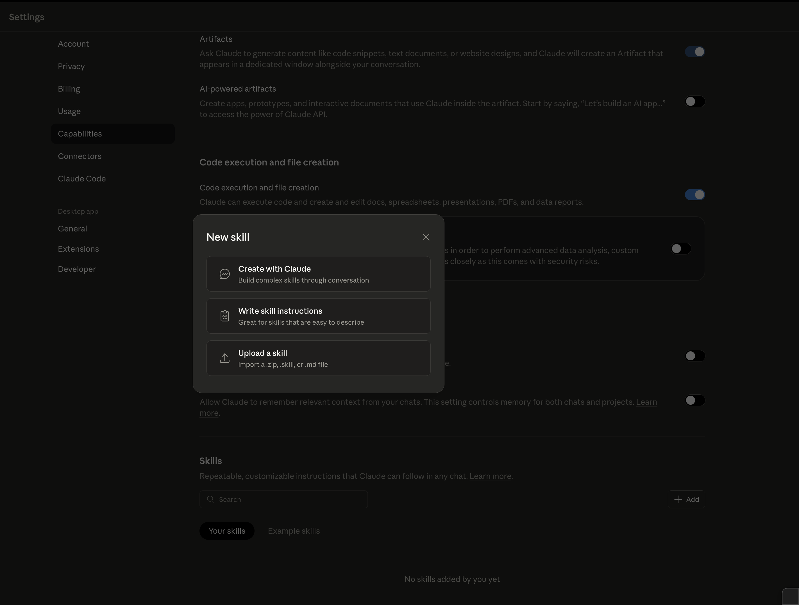
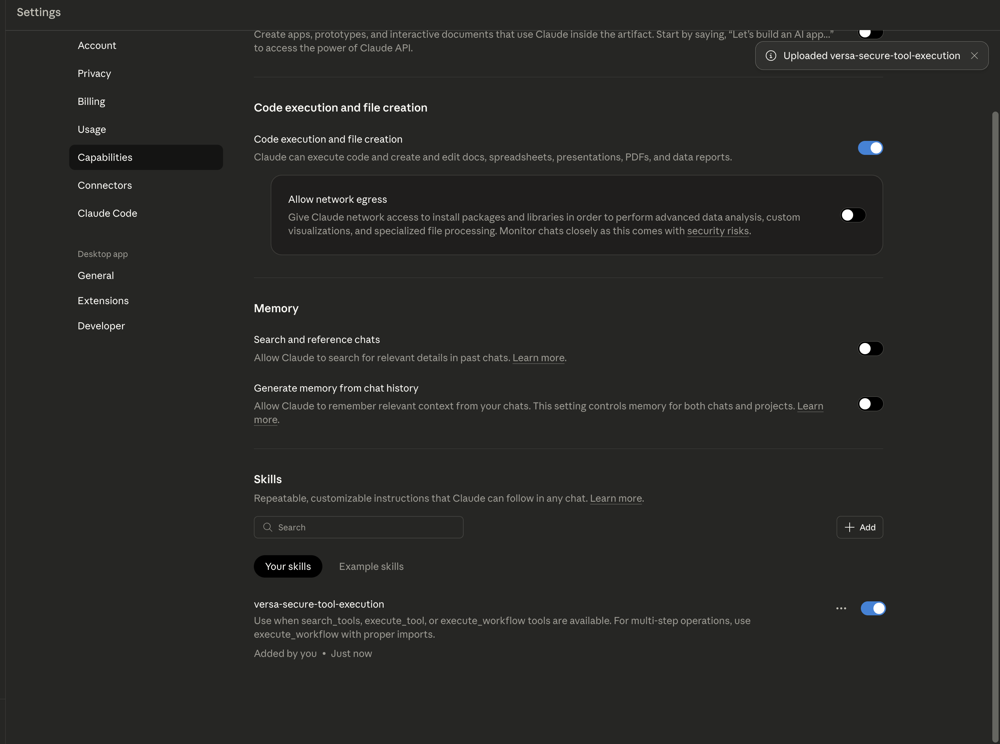
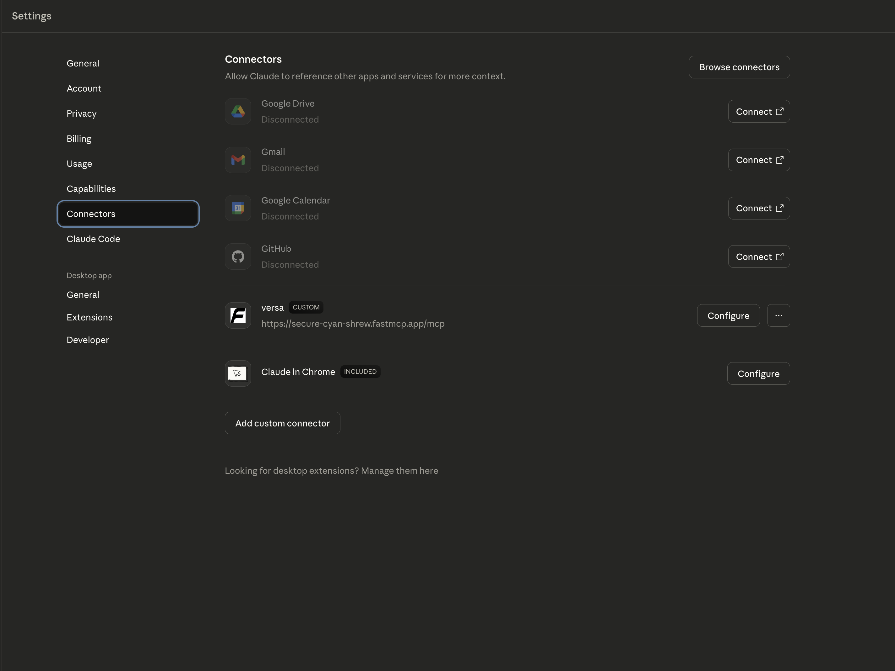
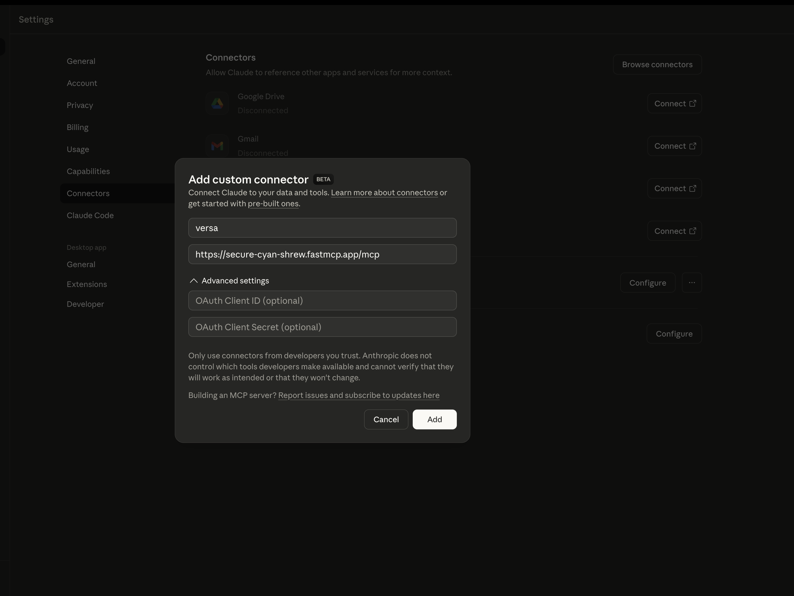
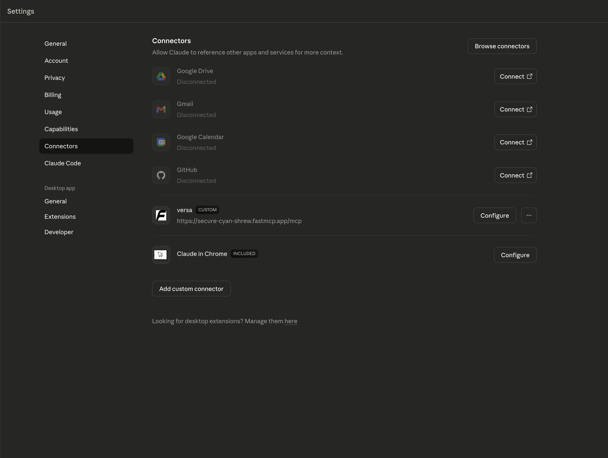

# Versa MCP Server

## Quick Start

```bash
uv run versa-mcp
```

Mock API responses are available in [src/versa_mcp/mocks/](src/versa_mcp/mocks/).
Validation added in [src/versa_mcp/mocks/id_registry.py](src/versa_mcp/mocks/id_registry.py) for realistic 404 responses when invalid IDs are used.

## Adding Skill to Claude Desktop

1. Open Claude Desktop → **Settings** → **Skills**
2. Click **Add Skill** and upload [skill-plugin/SKILL.md](skill-plugin/SKILL.md)

 

 




## Adding Versa Director MCP 

MCP Server: https://secure-cyan-shrew.fastmcp.app/mcp



 